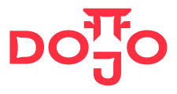

{width=300}

### Dojo is many things. It's a framework, a toolchain, and a community. It's a new way to build onchain applications that are provably fair and transparent.

It offers a straightforward way to define complex applications using [Cairo](https://www.cairo-lang.org/) and provides a comprehensive toolset for building, deploying, and managing your ambitious projects.

With Dojo, you can skip the hassle of writing complex indexers, managing intricate contract patterns, or setting up detailed query systems. 

Focus on bringing your ideas to life quickly and efficiently. From basic NFT projects to the most complex onchain games, Dojo is the perfect tool in your arsenal.


```
curl -L https://install.dojoengine.org | bash
```
